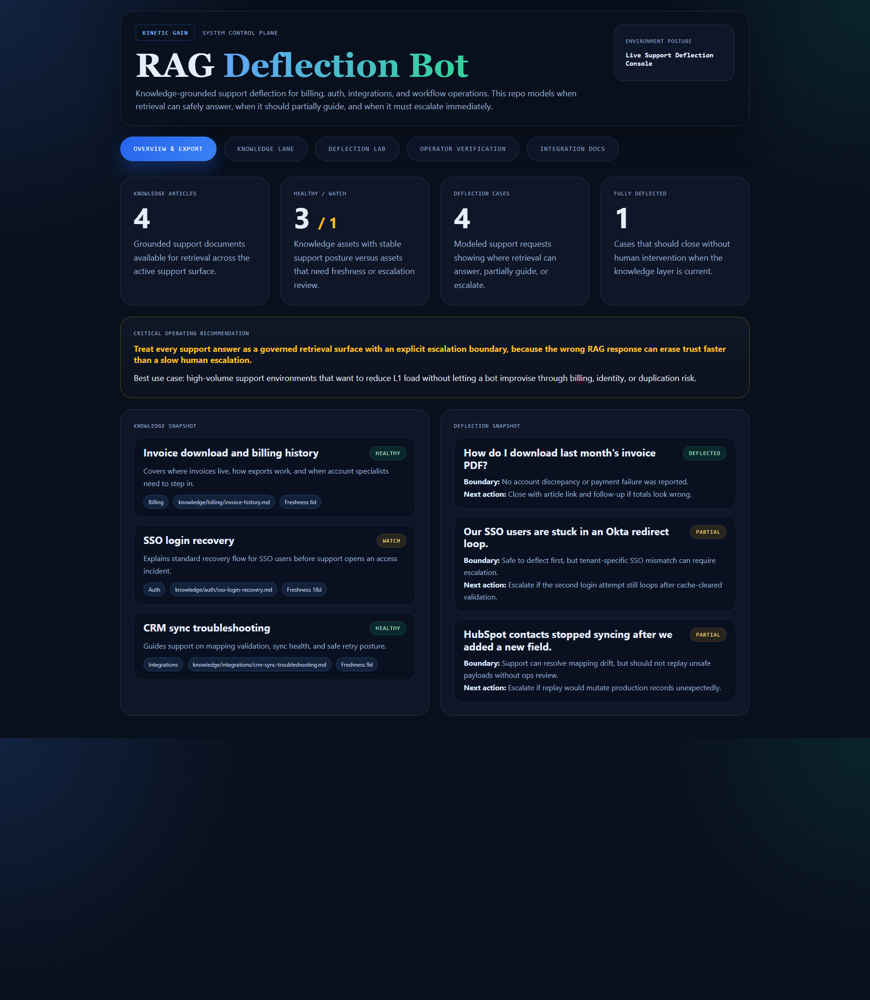
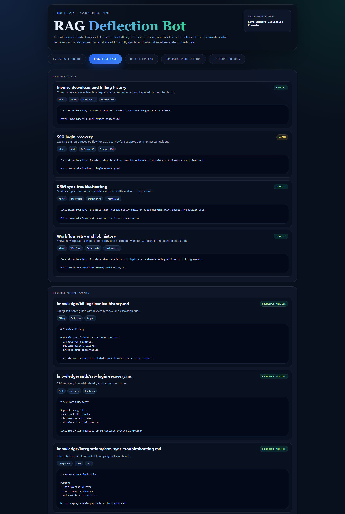
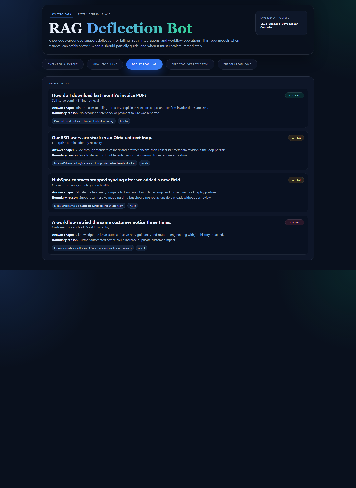

# rag-deflection-bot

Retrieval-grounded support deflection control plane for billing, auth, integrations, and workflow questions. This repo treats support automation as an operator system with knowledge freshness, escalation boundaries, and case-by-case deflection posture.

## What it shows

- knowledge-lane modeling for support articles and retrieval readiness
- deflection-lab cases showing deflect, partial, and escalate outcomes
- concrete knowledge artifacts instead of vague bot claims
- operator verification for grounded support automation

## Screenshots

### Overview



### Knowledge Lane



### Deflection Lab



## Routes

- `/`
- `/knowledge-lane`
- `/deflection-lab`
- `/verification`
- `/docs`

## API

- `/api/dashboard/summary`
- `/api/knowledge-lane`
- `/api/deflection-lab`
- `/api/knowledge-artifacts`
- `/api/verification`
- `/api/sample`

## Local development

```powershell
cd rag-deflection-bot
npm install
npm run dev
```

Then open:

- `http://127.0.0.1:5466/`
- `http://127.0.0.1:5466/knowledge-lane`
- `http://127.0.0.1:5466/deflection-lab`
- `http://127.0.0.1:5466/verification`
- `http://127.0.0.1:5466/docs`

## Validation

```powershell
npm run verify
npm run render:assets
```

## Documentation

- [docs/architecture.md](./docs/architecture.md)
- [docs/ORIGIN.md](./docs/ORIGIN.md)
